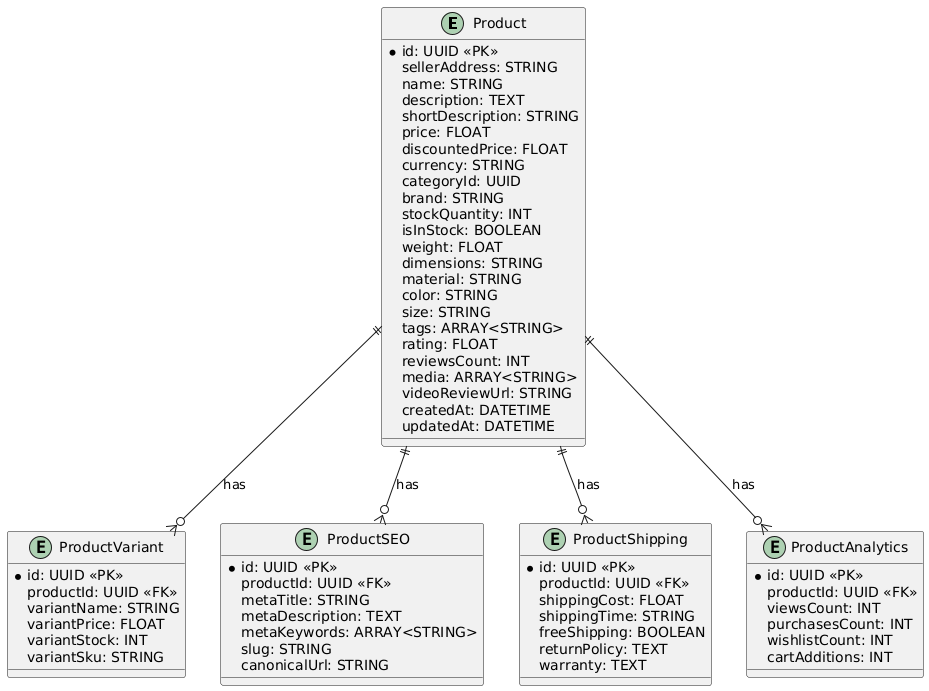

Here’s the **database structure** represented in **PlantUML** code. You can use this to generate a visual diagram of your database schema. I’ll also provide a **markdown table representation** for clarity.

---

### **1. PlantUML Code**
You can use this code in any PlantUML editor (e.g., [PlantText](https://planttext.com/) or [VS Code PlantUML extension](https://marketplace.visualstudio.com/items?itemName=jebbs.plantuml)) to generate the diagram.



---

### **2. Markdown Representation**

#### **Product Table**
| Field             | Type           | Description                              |
|-------------------|----------------|------------------------------------------|
| `id`              | UUID           | Primary key                              |
| `sellerAddress`   | STRING         | Seller's wallet address                  |
| `name`            | STRING         | Product name                             |
| `description`     | TEXT           | Detailed product description             |
| `shortDescription`| STRING         | Short product summary                    |
| `price`           | FLOAT          | Product price                            |
| `discountedPrice` | FLOAT          | Discounted price (if applicable)         |
| `currency`        | STRING         | Currency code (e.g., "USD")              |
| `categoryId`      | UUID           | Foreign key to category                  |
| `brand`           | STRING         | Brand name                               |
| `stockQuantity`   | INT            | Number of items in stock                 |
| `isInStock`       | BOOLEAN        | Whether the product is in stock          |
| `weight`          | FLOAT          | Product weight                           |
| `dimensions`      | STRING         | Product dimensions                       |
| `material`        | STRING         | Material used                            |
| `color`           | STRING         | Product color                            |
| `size`            | STRING         | Product size                             |
| `tags`            | ARRAY<STRING>  | Tags for filtering                       |
| `rating`          | FLOAT          | Average product rating                   |
| `reviewsCount`    | INT            | Number of reviews                        |
| `media`           | ARRAY<STRING>  | Array of media URLs (images/videos)      |
| `videoReviewUrl`  | STRING         | YouTube video review URL                 |
| `createdAt`       | DATETIME       | Timestamp when the product was created   |
| `updatedAt`       | DATETIME       | Timestamp when the product was updated   |

---

#### **ProductVariant Table**
| Field             | Type           | Description                              |
|-------------------|----------------|------------------------------------------|
| `id`              | UUID           | Primary key                              |
| `productId`       | UUID           | Foreign key to `Product`                 |
| `variantName`     | STRING         | Variant name (e.g., "Black, Size M")     |
| `variantPrice`    | FLOAT          | Variant price                            |
| `variantStock`    | INT            | Variant stock quantity                   |
| `variantSku`      | STRING         | Variant SKU                              |

---

#### **ProductSEO Table**
| Field             | Type           | Description                              |
|-------------------|----------------|------------------------------------------|
| `id`              | UUID           | Primary key                              |
| `productId`       | UUID           | Foreign key to `Product`                 |
| `metaTitle`       | STRING         | SEO title                                |
| `metaDescription` | TEXT           | SEO description                          |
| `metaKeywords`    | ARRAY<STRING>  | SEO keywords                             |
| `slug`            | STRING         | URL-friendly slug                        |
| `canonicalUrl`    | STRING         | Canonical URL for SEO                    |

---

#### **ProductShipping Table**
| Field             | Type           | Description                              |
|-------------------|----------------|------------------------------------------|
| `id`              | UUID           | Primary key                              |
| `productId`       | UUID           | Foreign key to `Product`                 |
| `shippingCost`    | FLOAT          | Shipping cost                            |
| `shippingTime`    | STRING         | Estimated shipping time                  |
| `freeShipping`    | BOOLEAN        | Whether free shipping is available       |
| `returnPolicy`    | TEXT           | Return policy description                |
| `warranty`        | TEXT           | Warranty information                     |

---

#### **ProductAnalytics Table**
| Field             | Type           | Description                              |
|-------------------|----------------|------------------------------------------|
| `id`              | UUID           | Primary key                              |
| `productId`       | UUID           | Foreign key to `Product`                 |
| `viewsCount`      | INT            | Number of product page views             |
| `purchasesCount`  | INT            | Number of purchases                      |
| `wishlistCount`   | INT            | Number of times added to wishlist        |
| `cartAdditions`   | INT            | Number of times added to cart            |

---

### **3. Relationships**
- **Product** has many **ProductVariants**.
- **Product** has one **ProductSEO**.
- **Product** has one **ProductShipping**.
- **Product** has one **ProductAnalytics**.

---

### **4. Visual Diagram**
If you use the PlantUML code in a PlantUML editor, you’ll get a visual diagram like this:

```
+-------------------+       +-------------------+
|    Product        |       | ProductVariant    |
|-------------------|       |-------------------|
| id (PK)           |<------| productId (FK)    |
| sellerAddress     |       | variantName       |
| name              |       | variantPrice      |
| description       |       | variantStock      |
| ...               |       | variantSku        |
+-------------------+       +-------------------+

+-------------------+       +-------------------+
|    ProductSEO     |       | ProductShipping   |
|-------------------|       |-------------------|
| id (PK)           |<------| productId (FK)    |
| productId (FK)    |       | shippingCost      |
| metaTitle         |       | shippingTime      |
| metaDescription   |       | freeShipping      |
| ...               |       | returnPolicy      |
+-------------------+       +-------------------+

+-------------------+
| ProductAnalytics  |
|-------------------|
| id (PK)           |
| productId (FK)    |
| viewsCount        |
| purchasesCount    |
| wishlistCount     |
| cartAdditions     |
+-------------------+
```

---

### **5. Notes**
- **Primary Keys (PK)**: Each table has a UUID primary key.
- **Foreign Keys (FK)**: Relationships are established using foreign keys.
- **Arrays**: Fields like `tags`, `metaKeywords`, and `media` are stored as arrays.
- **YouTube Stats**: Fetched dynamically using the YouTube Data API, so no need to store them in the database.

This structure ensures **normalization**, **scalability**, and **flexibility** for your e-commerce app.