# Tredit - Blockchain-Based E-commerce Platform with Escrow

**Author:** Victor Kipkorir Kirui  
**Reg No:** SCT221-0111/2021

---

A secure, blockchain-powered e-commerce and service platform with integrated escrow and social media features, designed for Kenyan SMEs. Tredit leverages modern web and blockchain technologies to provide a trusted, transparent, and user-friendly marketplace for buyers and sellers.

## Table of Contents

- [Project Overview](#project-overview)
- [Screenshots](#screenshots)
- [Features](#features)
- [System Architecture](#system-architecture)
- [Technology Stack](#technology-stack)
- [Getting Started](#getting-started)
- [Project Structure](#project-structure)
- [Smart Contracts](#smart-contracts)
- [Testing Strategy](#testing-strategy)
- [Deployment](#deployment)
- [Support & Documentation](#support--documentation)
- [Contributing](#contributing)
- [License](#license)
- [Acknowledgments](#acknowledgments)

## Project Overview

Tredit is a decentralized e-commerce platform tailored for the Kenyan market, combining:

- **Blockchain-based escrow** for secure transactions
- **Social media integration** for business growth
- **Local payment gateways** (M-Pesa, Paystack)
- **User and business verification**
- **Dispute resolution**

The platform is built with Next.js, TypeScript, Tailwind CSS, and Solidity smart contracts on Polygon. It supports both fiat and crypto payments, leverages IPFS for decentralized file storage, and provides a seamless, mobile-first user experience.

**Target Users:**

- Small and medium businesses (SMEs)
- Individual sellers and buyers
- Platform administrators
- Developers and integrators

**Unique Value:**

- Reduces online fraud with escrow and verification
- Enables easy sharing and marketing via social media
- Supports local payment habits and currencies
- Transparent, auditable, and scalable

## Screenshots

### Home Page

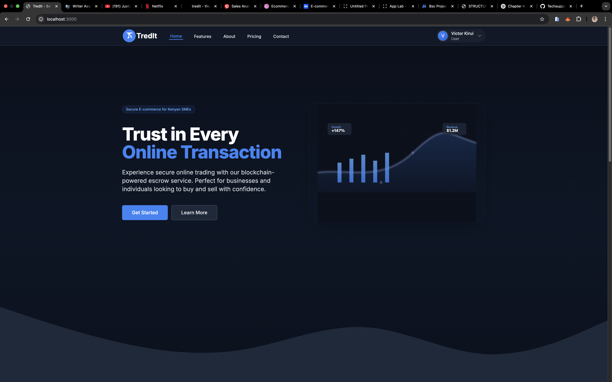
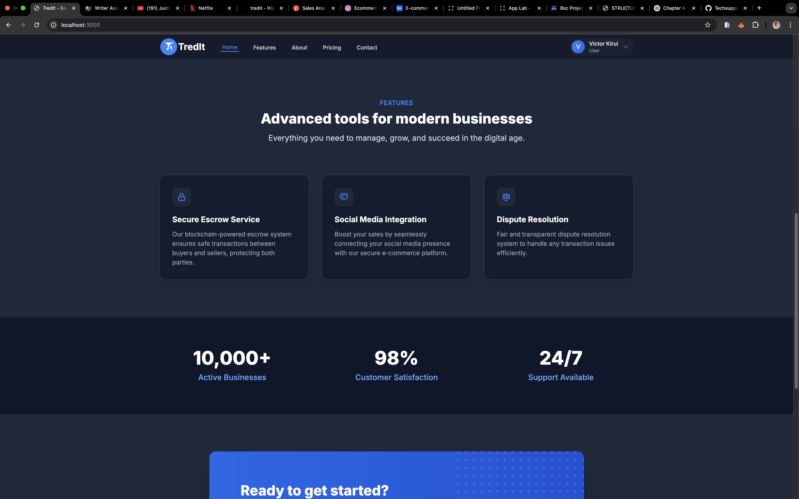

_Landing page featuring platform features, statistics, and call-to-action sections._

### CTA Section

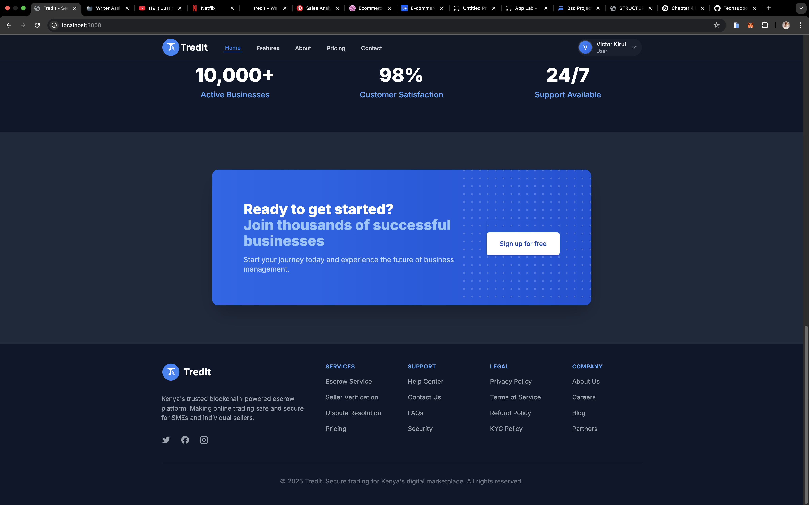
_Showcase of advanced tools for modern businesses._

### Dashboard

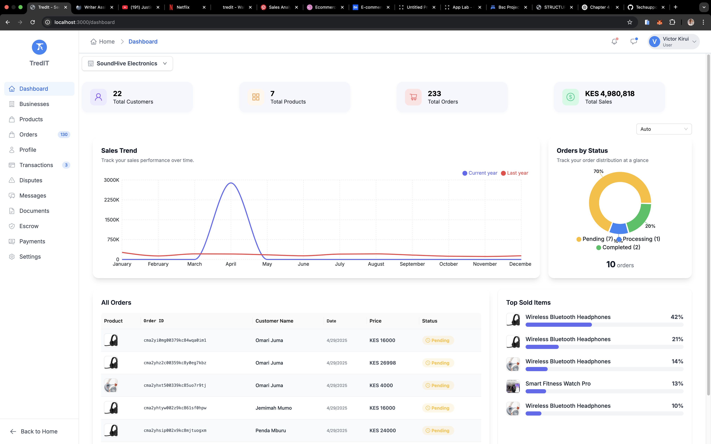
_Business overview with analytics, charts, and key metrics._

### Business Storefront

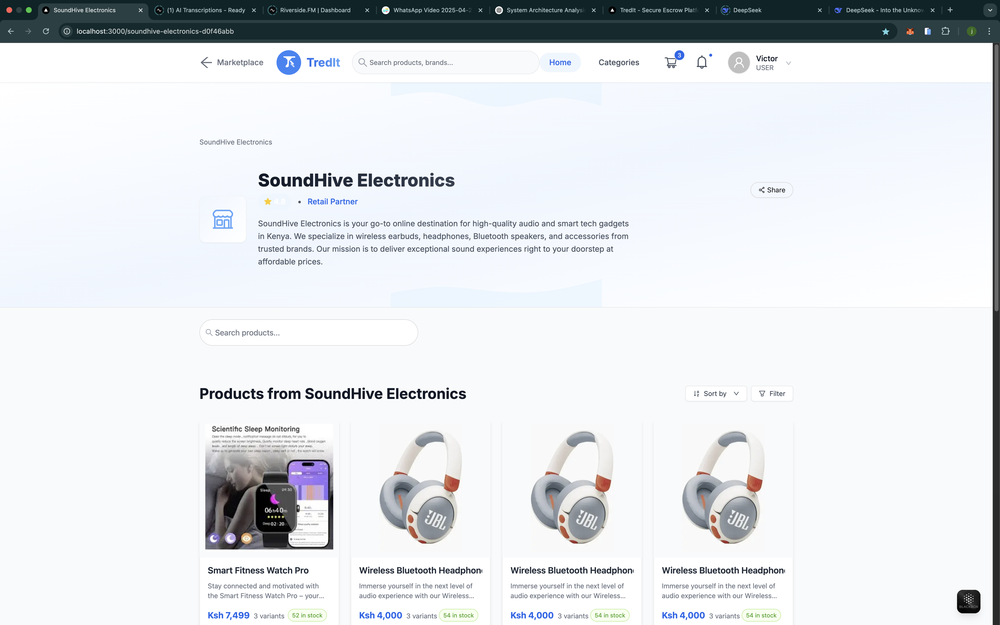
_Dynamic business pages with custom storefronts for each business._

### Product Grid

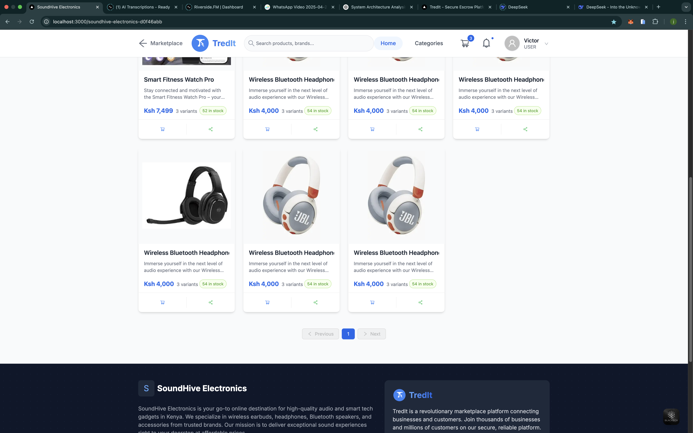
_Product browsing and management interface._

### Authentication - Login

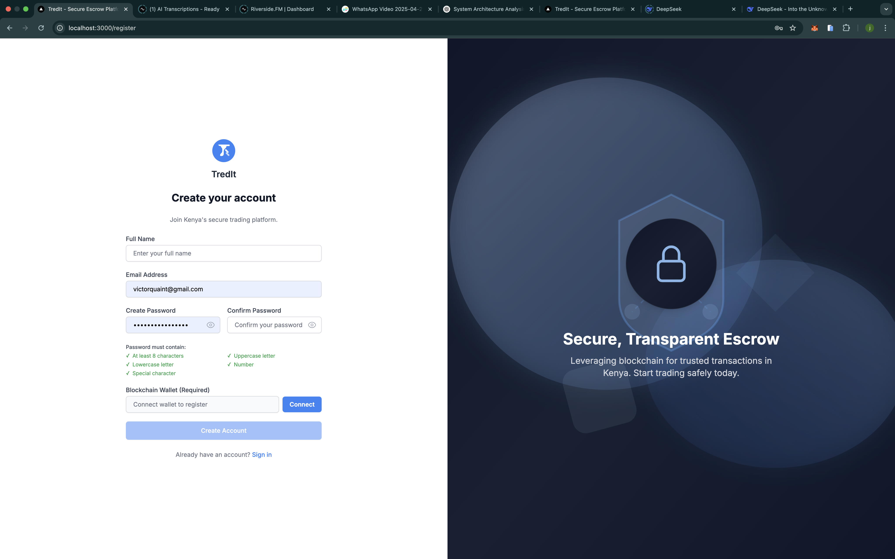
_User authentication interface._

### Authentication - Register

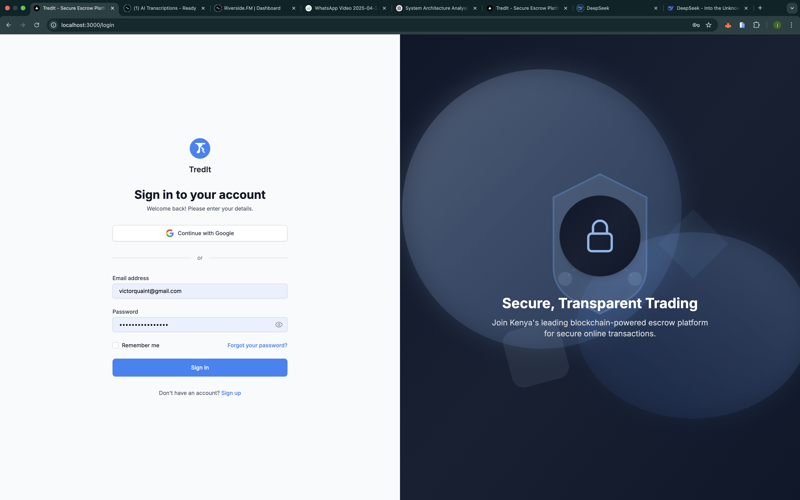
_User registration interface with wallet integration._

### Social Media Integration

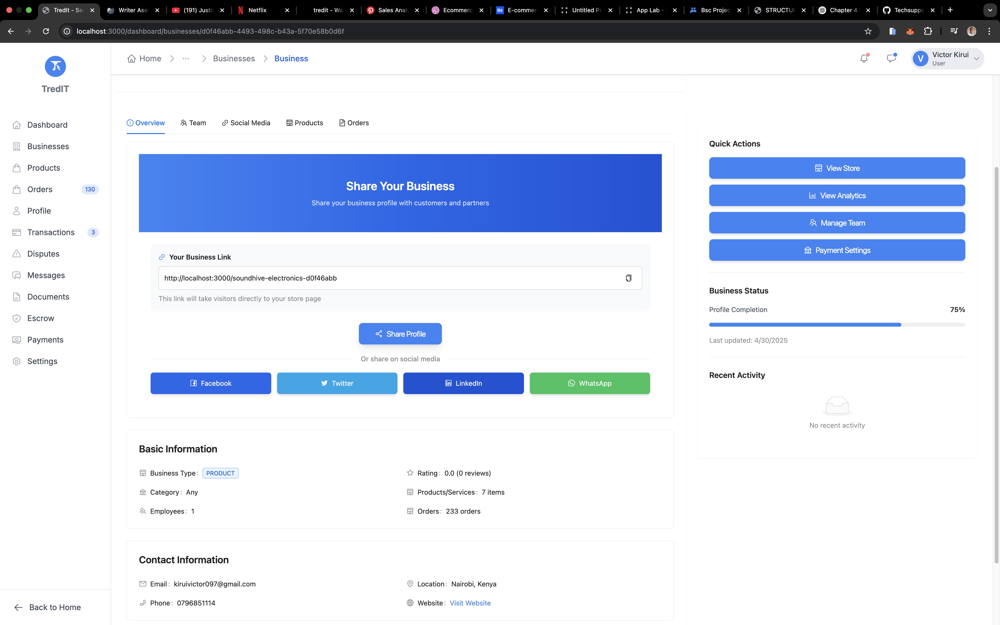
_Comprehensive social media integration for sharing and analytics._

### Social Media Connection

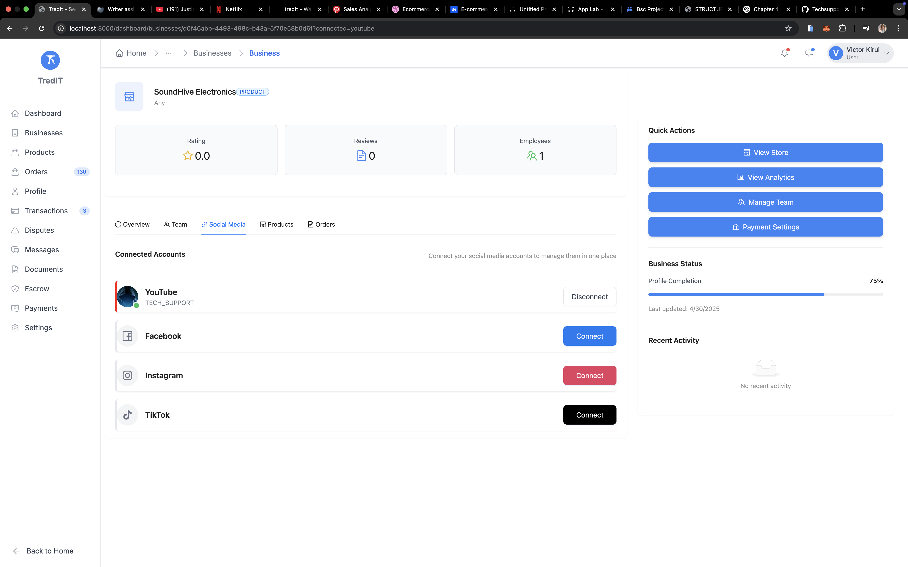
_Social media connection interface._

### System Architecture

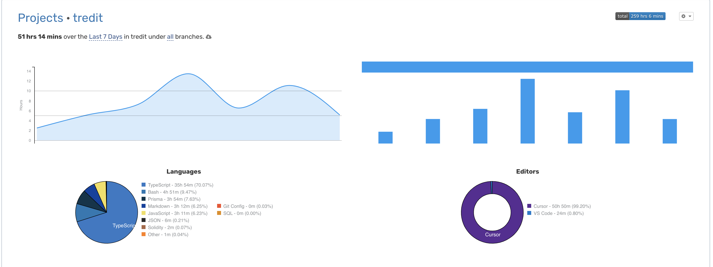
_High-level architecture of the Tredit platform._

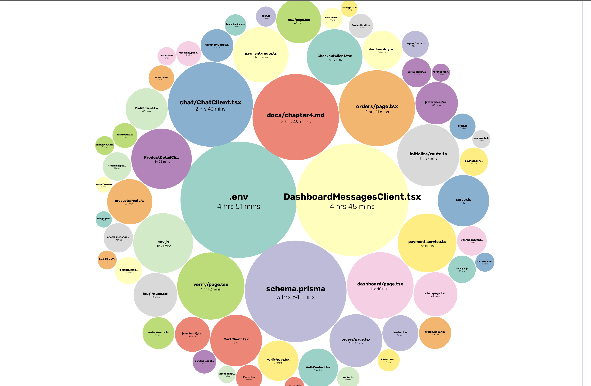
_Development environment and workflow overview._

## Features

Tredit offers a comprehensive suite of features for secure, efficient, and user-friendly e-commerce:

- **Secure Escrow Service:** Blockchain-powered escrow ensures safe transactions between buyers and sellers, protecting both parties until delivery is confirmed.
- **Social Media Integration:** Share product listings and business profiles across YouTube, Facebook, Instagram, and TikTok. Boosts sales and trust through verified social presence.
- **Dispute Resolution:** Built-in smart contract and admin tools for fair, transparent dispute handling, including evidence submission and arbitration.
- **Business & User Verification:** On-chain business registration, KYC, and reputation scoring to build trust and reduce fraud.
- **Multi-Payment Support:** Accepts both crypto (Polygon/MATIC) and local fiat (M-Pesa, Paystack) payments, with seamless conversion and escrow management.
- **Product Management:** Sellers can create, update, and manage listings with images stored on IPFS for decentralization and reliability.
- **Analytics Dashboard:** Real-time business insights, sales trends, and order tracking for sellers and admins.
- **Mobile-First Design:** Fully responsive, optimized for Kenya's mobile-driven market.
- **Notifications:** Real-time updates for order status, payments, disputes, and more via email/SMS.
- **Role-Based Access:** Secure admin, seller, and buyer roles with NextAuth.js and Google OAuth.

## System Architecture

Tredit is built on a robust, layered architecture for scalability, security, and maintainability:

- **Presentation Layer:** Next.js frontend, mobile-first, with clear navigation and user flows.
- **Application Layer:** Node.js/Express backend, RESTful APIs, business logic, and authentication.
- **Data Layer:**
  - **PostgreSQL** for structured data (users, products, orders, disputes)
  - **Polygon blockchain** for escrow, payments, and verification
  - **IPFS** for decentralized file storage (product images, evidence)

**Key Architectural Features:**

- Modular, component-based frontend
- API routes for all business logic
- Smart contracts for core trust and payment logic
- Middleware for multitenancy and access control
- Environment-based configuration for dev/prod

## Technology Stack

**Frontend:**

- Next.js 14 (App Router, SSR/SSG)
- TypeScript (strict mode, type-safe APIs)
- Tailwind CSS (custom theming, dark mode)

**Backend:**

- Node.js 18+
- Express.js
- Prisma ORM
- PostgreSQL 15+

**Blockchain:**

- Solidity 0.8.20
- Polygon (Amoy testnet, mainnet ready)
- Hardhat (testing, deployment)
- OpenZeppelin (security, upgradability)

**Storage:**

- IPFS (Pinata)
- Supabase (optional for file metadata)

**Authentication:**

- NextAuth.js
- Google OAuth

**Payments:**

- Paystack (KES)
- M-Pesa (planned)
- Polygon/MATIC

## Getting Started

### Prerequisites

- Node.js 18.x or higher
- PostgreSQL 15.x
- MetaMask wallet
- Git

### Installation

1. Clone the repository:

```bash
git clone https://github.com/yourusername/tredit.git
cd tredit
```

2. Install dependencies:

```bash
npm install
```

3. Set up environment variables:

```bash
cp .env.example .env
# Edit .env with your configuration
```

4. Set up the database:

```bash
# Generate Prisma Client
npx prisma generate

# Run migrations
npx prisma migrate dev

# Seed the database (optional)
npx prisma db seed
```

5. Start the development server:

```bash
npm run dev
```

**Environment Variables:**

- See `.env.example` for all required keys (DB, blockchain, IPFS, Paystack, OAuth, etc.)
- Use separate configs for development and production

**Tips for New Contributors:**

- Use `npx prisma studio` to view/edit DB
- Use `npx hardhat node` for local blockchain testing
- See `/docs/chapter4.md` for full implementation details

## Project Structure

```
tredit/
├── app/                    # Next.js app directory
├── components/            # React components
├── contracts/            # Solidity smart contracts
├── prisma/              # Database schema and migrations
├── public/              # Static assets
├── scripts/             # Utility scripts (deploy, test, seed)
├── src/                 # Source code (lib, types, config)
├── docs/                # Documentation, screenshots, guides
└── tests/               # Test files (unit, integration, e2e)
```

## Smart Contracts

Tredit's decentralized trust is powered by a suite of audited smart contracts:

- **Escrow.sol:** Holds funds securely until delivery is confirmed or a dispute is resolved. Implements checks-effects-interactions, reentrancy protection, and admin override for disputes.
- **Business.sol:** Manages business registration, verification, and reputation. Links on-chain business IDs to off-chain profiles and KYC.
- **UserProfile.sol:** Handles user identity, wallet integration, and profile updates. Supports privacy controls and secure updates.
- **Payment.sol:** Processes both crypto and fiat payments, integrates with Paystack, and manages payment lifecycle and refunds.
- **Dispute.sol:** Enables dispute creation, evidence submission, and resolution. Supports both automated and admin-driven arbitration.
- **TreditToken.sol:** Platform's native token for rewards, fees, and governance (future roadmap).

**Contract Interactions:**

- Orders trigger escrow creation
- Delivery confirmation or dispute triggers fund release or arbitration
- All contract addresses and ABIs are managed via environment variables

## Testing Strategy

Tredit uses a multi-layered testing approach for reliability and security:

- **Unit Testing:**
  - Smart contracts (Hardhat, Chai)
  - UI components (Jest, React Testing Library)
- **Integration Testing:**
  - API endpoints (Supertest)
  - Contract interactions (Hardhat, ethers.js)
  - Database operations (Prisma)
- **End-to-End Testing:**
  - User flows (Cypress)
  - Transaction lifecycle (escrow, payment, dispute)
- **Performance & Security:**
  - Load testing (autocannon)
  - Security checks (reentrancy, input validation)

**Coverage:**

- > 90% for smart contracts (see `/docs/chapter4.md` for detailed results)
- 80%+ for frontend and backend

## Deployment

### Frontend

1. Build the application:

```bash
npm run build
```

2. Start the production server:

```bash
npm run start
```

### Smart Contracts

1. Deploy to Polygon testnet:

```bash
npx hardhat run scripts/deploy.mjs --network polygonAmoy
```

2. Verify contracts:

```bash
npx hardhat verify --network polygonAmoy [CONTRACT_ADDRESS]
```

**Best Practices:**

- Use separate wallets/keys for dev, staging, and prod
- Store secrets securely (never commit `.env`)
- Monitor contract addresses and update frontend configs as needed

## Support & Documentation

- **User Guides:** `/docs/chapter4.md`, `/docs/docs.md`
- **API Reference:** See `/src/app/api` and OpenAPI docs (if enabled)
- **Developer Docs:** In-code comments, `/docs/`, and smart contract NatSpec
- **Community:**
  - Email: support@tredit.ke
  - Telegram: https://t.me/tredit
  - Discord: https://discord.gg/tredit
  - Twitter: @tredit_ke

## Contributing

1. Fork the repository
2. Create your feature branch (`git checkout -b feature/AmazingFeature`)
3. Commit your changes (`git commit -m 'Add some AmazingFeature'`)
4. Push to the branch (`git push origin feature/AmazingFeature`)
5. Open a Pull Request

**Code Style:**

- TypeScript strict mode
- ESLint and Prettier enforced
- Write tests for new features
- Document your code and APIs

<!-- user Guide -->

# User Guide

# [Create Business Profile in Tredit](https://app.tango.us/app/workflow/62643f7e-bcbe-4033-9c7b-e6318a623f49?utm_source=markdown&utm_medium=markdown&utm_campaign=workflow%20export%20links)

**Creation Date:** Apr 30, 2025  
**Created By:** Victor Quaint  
[View most recent version on Tango.ai](https://app.tango.us/app/workflow/62643f7e-bcbe-4033-9c7b-e6318a623f49?utm_source=markdown&utm_medium=markdown&utm_campaign=workflow%20export%20links)

---

## # [Tredit](http://localhost:3000/)

### 1. Click on Get Started/Sign im

User authentication


### 2. Type your details and connect your wallet


### 3. Type "kiruivictor097@gmail.com"

### 4. Type password


### 5. Paste input


### 6. Click on Connect


### 7. Click on Create Account


### 8. Click on Sign in


### 9. Type "kiruivictor097@gmail.com"

### 10. Type password


### 11. Check Remember me


### 12. Click on Sign In


### 13. Click on Businesses


### 14. Click on Add Business


### 15. Click on Business Name


### 16. Click on Business Type


### 17. Click on Business Description


### 18. Click on Business Category


### 19. Click on Contact Details


### 20. Click on Business Model


### 21. Click on Payment & Shipping


### 22. Type "0796851114"

### 23. Type "254"

### 24. Type "Nairobi"


### 25. Click on Save & Continue


### 26. Click on Business Model


### 27. Click on Marketplace


### 28. Click on Operation Mode


### 29. Click on Hybrid


### 30. Click on Business Size


### 31. Click on Large


### 32. Click on Business Stage


### 33. Click on Enterprise


### 34. Click on Save & Continue


### 35. Click on Accepted Payment Methods


### 36. Click on Mpesa


### 37. Click on Card


### 38. Click on Bank Transfer


### 39. Click on Primary Currency


### 40. Click on Tax Category


### 41. Click on Turnover Tax


### 42. Click on Shipping Method


### 43. Click on International


### 44. Click on Businesses


### 45. Click on SoundHive Electronics is your go-to online destination for high-quality audio and smart tech gadgets in Kenya. We specialize in wireless earbuds, headphones, Bluetooth speakers, and accessories from trusted brands. Our mission is to deliver exceptional sound experiences …


### 46. Click on Overview…


### 47. Click on Social Media


### 48. Click on Products


### 49. Click on Orders


### 50. Click on Products


### 51. Click on Social Media


### 52. Click on Social Media


### 53. Click on Social Media


### 54. Click on Overview


### 55. Click on Copy link


### 56. Click on Overview


### 57. Click on Share Profile


### 58. Click on Overview


### 59. Copy input titled "http://localhost:3000/soundhive-electronics-d0f46abb"


### 60. Share the link to be accessed by others


### 61. Click on Victor…


### 62. Click on Products from SoundHive Electronics…


### 63. Click on Add to cart


### 64. Click on highlight


### 65. Click on Dispute Order


### 66. Copy text


### 67. Paste selected text into text area


### 68. Click on Reason for Dispute…


### 69. Click on Quality Issue


### 70. Click on Submit Dispute


### 71. Click on Your Orders…


### 72. Click on Orders…


### 73. Click on Transactions


### 74. Click on Escrow


### 75. Click on Release


### 76. Click on Dashboard


<br/>

---

Created with [Tango.ai](https://tango.ai?utm_source=markdown&utm_medium=markdown&utm_campaign=workflow%20export%20links)

## License

This project is licensed under the MIT License - see the [LICENSE](LICENSE) file for details.

## Acknowledgments

- [Polygon Network](https://polygon.technology/)
- [OpenZeppelin](https://openzeppelin.com/)
- [Next.js](https://nextjs.org/)
- [Prisma](https://www.prisma.io/)
- [Pinata](https://www.pinata.cloud/)
- [Paystack](https://paystack.com/)
- [Supabase](https://supabase.com/)

---

_This project was developed as part of the BSc. Information Technology degree at Jomo Kenyatta University of Agriculture and Technology._
